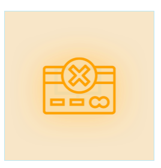
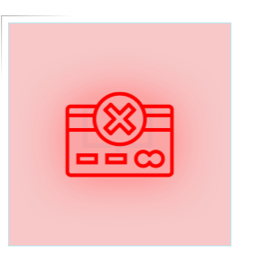
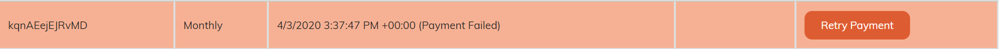
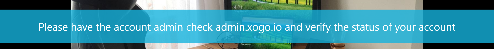

# XOGO Billing V3

## License States 

* **PastDue**: If the license status is **PastDue**, the player attached to the license will be displayed as an orange icon. 

* **Frozen**: If the license status is **Frozen** and the player is attached to the license, the player will be displayed as a red icon.

**Frozen** licenses will be displayed as red in the admin portal. 

If the **frozen** license is attached to a player, the overlay, shown below, will be displayed on the player.

## Free To Pro Tier Migrations

* The user selects the **upgrade** button and enters billing information on the admin portal.
* A **Pro** license will be issued immediately.
* If the charge fails, the license will be marked as **PastDue**. In this scenario, the customer needs to update their credit card information. 
* The first license payment must succeed in 24 hours. Otherwise, the license state will turn to **Frozen**. (Testing in progress…)

## Pro customer - a new license purchasing scenario
* The user selects the **buy more** button on the admin portal.
* A **Pro** license will be issued immediately.
* If the charge fails, the license will be marked as **PastDue**. In this scenario, the customer needs to update their credit card information. 
* The first license payment must succeed in 24 hours. Otherwise, the license state will turn to **Frozen**. (Testing in progress…)

## Pro customer – license renewing scenario
* Licenses renewals will be automatically handled by stripe. 
* If the payment succeeds, the license will be renewed.
* If the payment fails, the license status will turn to **PastDue**. Stripe will retry payment in a day. If the payment fails again, the license’s status will switch to **Frozen**. 

